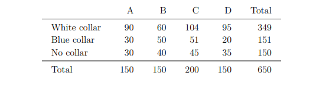

# Machine-Learning-and-Statistics-Assessments

Jupyter Notebook containing four assessments which we will be given over the duration of the semester. 

### If you are having problems with Github not displaying the contents of the notebook. 

Sometimes Github will not display the contents of the notebooks. If this happens, copy the url of the notebook page, and paste here: https://nbviewer.jupyter.org/ 

### Task 1. 

- Write a Python function called sqrt2 that calculates and
prints to the screen the square root of 2 to 100 decimal places. Your code should
not depend on any module from the standard library1 or otherwise. You should
research the task first and include references and a description of your algorithm.

### Task2. 

- The Chi-squared test for independence is a statistical
hypothesis test like a t-test. It is used to analyse whether two categorical variables
are independent. The Wikipedia article gives the table below as an example [4],
stating the Chi-squared value based on it is approximately 24.6. Use scipy.stats
to verify this value and calculate the associated p value. You should include a short
note with references justifying your analysis in a markdown cell.

### Task 3. 

The standard deviation of an array of numbers x is
calculated using numpy as np.sqrt(np.sum((x - np.mean(x))**2)/len(x)) .
However, Microsoft Excel has two different versions of the standard deviation
calculation, STDEV.P and STDEV.S . The STDEV.P function performs the above
calculation but in the STDEV.S calculation the division is by len(x)-1 rather
than len(x) . Research these Excel functions, writing a note in a Markdown cell
about the difference between them. Then use numpy to perform a simulation
demonstrating that the STDEV.S calculation is a better estimate for the standard
deviation of a population when performed on a sample. Note that part of this task
is to figure out the terminology in the previous sentence.

